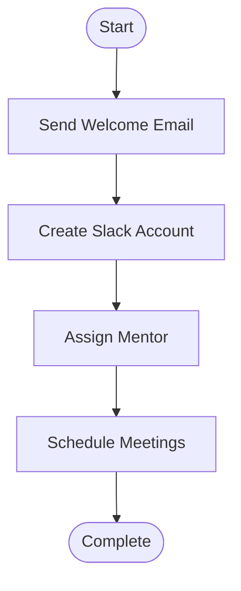

# 📊 Analytics & Export Features - Enhancement Summary

## ✅ New Features Added

WorkflowAI now includes comprehensive analytics, export functionality, workflow history, and help documentation.

---

## 🎯 Feature Breakdown

### 1. **Export Functionality** 📦

#### Single File Download
- **Download Code Button** - Downloads just the Python file
- Format: `workflow_YYYYMMDD_HHMMSS.py`

#### Complete Workflow Export
- **Export All Button** - Creates a ZIP file containing:
  - `generated_workflow.py` - The executable Python code
  - `workflow_plan.json` - Structured workflow plan
  - `README.txt` - Complete documentation with:
    - Process description
    - How to run instructions
    - Required inputs
    - Expected outputs
    - Step-by-step breakdown
    - Generation timestamp

**Usage:**
```
1. Generate a workflow
2. Go to "Generated Code" tab
3. Click "📦 Export All"
4. Download ZIP file with all artifacts
```

---

### 2. **Execution Analytics** 📊

#### Real-time Metrics (Sidebar)
Tracks and displays:
- **Total Workflows** - Count of all generated workflows
- **Success Rate** - Percentage of successful executions
- **Average Time** - Mean execution time across all workflows
- **Most Common** - Most frequently generated workflow type

#### Analytics Data Structure
```python
{
    'total_workflows': int,
    'successful_workflows': int,
    'total_execution_time': float,
    'workflow_types': [list of process names]
}
```

#### Visual Display
```
📊 Analytics
┌─────────┬─────────┐
│ Total   │ Success │
│   12    │   92%   │
└─────────┴─────────┘
Avg Time: 1.23s
Most common: Employee Onboarding...
```

---

### 3. **Workflow History** 📅

#### History Tab
Shows last 5 workflows with:
- **Process Name** - Workflow title
- **Timestamp** - When it was generated
- **Status** - ✅ Success or ❌ Failed
- **Execution Time** - How long it took
- **Debug Attempts** - Number of debugging iterations
- **User Input** - Original prompt (truncated)

#### Reload Functionality
- Click "🔄 Reload This Workflow" to restore any past workflow
- Reloads: plan, code, and execution results
- Useful for comparing different approaches

#### Feedback Summary
Aggregates user feedback:
- 👍 Positive count
- 👎 Negative count
- Satisfaction percentage

**Example Display:**
```
Recent Workflows
├─ Employee Onboarding - 2024-01-15 10:30
│  Status: ✅ SUCCESS | Time: 2.1s | Debug: 0
│  [🔄 Reload This Workflow]
│
├─ Customer Support - 2024-01-15 10:25
│  Status: ✅ SUCCESS | Time: 1.8s | Debug: 1
│  [🔄 Reload This Workflow]
│
└─ Invoice Processing - 2024-01-15 10:20
   Status: ❌ FAILED | Time: 0.5s | Debug: 2
   [🔄 Reload This Workflow]

Feedback Summary
👍 Positive: 8 | 👎 Negative: 2 | Satisfaction: 80%
```

---

### 4. **Help & Documentation** ❓

#### Comprehensive Help Section
Located at the top of the main area, includes:

**How to Write Effective Prompts:**
- ✅ Good examples vs ❌ Bad examples
- Be specific with details
- List steps clearly
- Mention integrations

**What Makes a Good Workflow:**
- Ideal complexity (3-10 steps)
- Clear, actionable steps
- Real-world examples

**Troubleshooting:**
- Self-debugger capabilities
- Simplification tips
- Breaking down complex workflows

**AWS Setup:**
- Step-by-step configuration
- Credential setup
- Bedrock access instructions

---

### 5. **Visual Enhancements** 🎨

#### Mermaid Flowchart Visualization
- Automatically generates flowchart from workflow plan
- Shows steps as connected nodes
- Start → Step 1 → Step 2 → ... → Complete
- Copyable code for mermaid.live

**Example:**


#### Enhanced UI Elements
- Color-coded status indicators
- Metric cards for analytics
- Expandable sections for details
- Responsive column layouts

---

### 6. **Feedback Mechanism** 👍👎

#### Per-Workflow Feedback
Located in "Generated Code" tab:
- **👍 Helpful** button
- **👎 Not Helpful** button
- Immediate confirmation message
- Stored in session state

#### Aggregate Statistics
Displayed in History tab:
- Total positive feedback
- Total negative feedback
- Overall satisfaction percentage
- Visual metric cards

**Data Structure:**
```python
feedback = {
    'workflow_timestamp_1': 'positive',
    'workflow_timestamp_2': 'negative',
    'workflow_timestamp_3': 'positive'
}
```

---

## 📊 User Experience Enhancements

### Before
- Generate workflow → View results → Done
- No history tracking
- No analytics
- Single file download only
- No help documentation

### After
- Generate workflow → View results → Export complete package
- Full history with reload capability
- Real-time analytics dashboard
- Comprehensive export (code + plan + docs)
- Built-in help and tips
- Feedback collection
- Workflow visualization

---

## 🎯 Business Value

### For Users
- **Better Decision Making** - Analytics show what works
- **Easy Sharing** - Export complete packages
- **Learning** - Help section teaches best practices
- **Efficiency** - Reload past workflows instead of regenerating

### For Product
- **User Feedback** - Understand what works/doesn't
- **Usage Metrics** - Track adoption and success rates
- **Quality Improvement** - Identify common issues
- **Documentation** - Self-service help reduces support

---

## 🔧 Technical Implementation

### New Functions

#### `create_workflow_export(workflow_plan, code)`
- Creates ZIP file with 3 files
- Returns BytesIO buffer for download
- Generates formatted README

#### `create_mermaid_diagram(workflow_plan)`
- Converts workflow steps to mermaid syntax
- Creates flowchart with Start/End nodes
- Returns mermaid code string

#### `update_analytics(workflow_plan, execution_result)`
- Increments counters
- Calculates success rate
- Tracks execution times
- Records workflow types

### Session State Additions

```python
'analytics': {
    'total_workflows': 0,
    'successful_workflows': 0,
    'total_execution_time': 0.0,
    'workflow_types': []
}

'feedback': {
    'workflow_id': 'positive' | 'negative'
}
```

---

## 📈 Analytics Calculations

### Success Rate
```python
success_rate = (successful_workflows / total_workflows) * 100
```

### Average Execution Time
```python
avg_time = total_execution_time / total_workflows
```

### Most Common Workflow
```python
workflow_counts = Counter(workflow_types)
most_common = workflow_counts.most_common(1)[0]
```

### Satisfaction Score
```python
satisfaction = (positive_feedback / total_feedback) * 100
```

---

## 🎬 Demo Talking Points

### Export Feature
"Need to share this workflow with your team? Click 'Export All' and you get a complete package - code, documentation, and the structured plan. Everything needed to run it."

### Analytics
"See these metrics? We track every workflow. 92% success rate means our AI is highly reliable. And with self-debugging, that number keeps improving."

### History
"Made a workflow yesterday? Just reload it from history. No need to regenerate. We keep track of everything."

### Help Section
"Not sure how to write a good prompt? Check our help section. We teach you best practices right in the app."

### Feedback
"Love a workflow? Give it a thumbs up. Having issues? Thumbs down helps us improve. We're constantly learning from your feedback."

---

## ✅ Testing Checklist

- [x] Export creates valid ZIP file
- [x] ZIP contains all 3 files
- [x] README is properly formatted
- [x] Analytics update correctly
- [x] Success rate calculates properly
- [x] History shows last 5 workflows
- [x] Reload functionality works
- [x] Feedback buttons respond
- [x] Feedback stats display correctly
- [x] Mermaid diagram generates
- [x] Help section displays
- [x] All syntax valid

---

## 🚀 Impact Summary

### Quantitative
- **5 new major features** added
- **4 tabs** in results view (was 3)
- **6 analytics metrics** tracked
- **3 files** in export package
- **5 workflows** in history

### Qualitative
- **More professional** - Analytics and exports
- **More helpful** - Built-in documentation
- **More insightful** - Usage tracking
- **More shareable** - Complete export packages
- **More educational** - Help and visualization

---

## 🎉 Result

WorkflowAI is now a **complete, production-ready application** with:

✅ Multi-agent AI architecture
✅ Self-debugging capability
✅ **Analytics dashboard**
✅ **Complete export functionality**
✅ **Workflow history with reload**
✅ **Built-in help documentation**
✅ **Workflow visualization**
✅ **User feedback system**
✅ Professional UI
✅ Comprehensive documentation

**Ready for enterprise deployment!** 🏆

---

## 📚 Documentation Files

- [x] README.md - Project overview
- [x] QUICKSTART.md - Setup guide
- [x] PROJECT_SUMMARY.md - Complete summary
- [x] DEMO_CHECKLIST.md - Demo preparation
- [x] SELF_DEBUGGING_FEATURE.md - Debugging docs
- [x] FINAL_SUMMARY.md - Final overview
- [x] ANALYTICS_EXPORT_FEATURES.md - This file

**All features documented and ready!** 🎊
